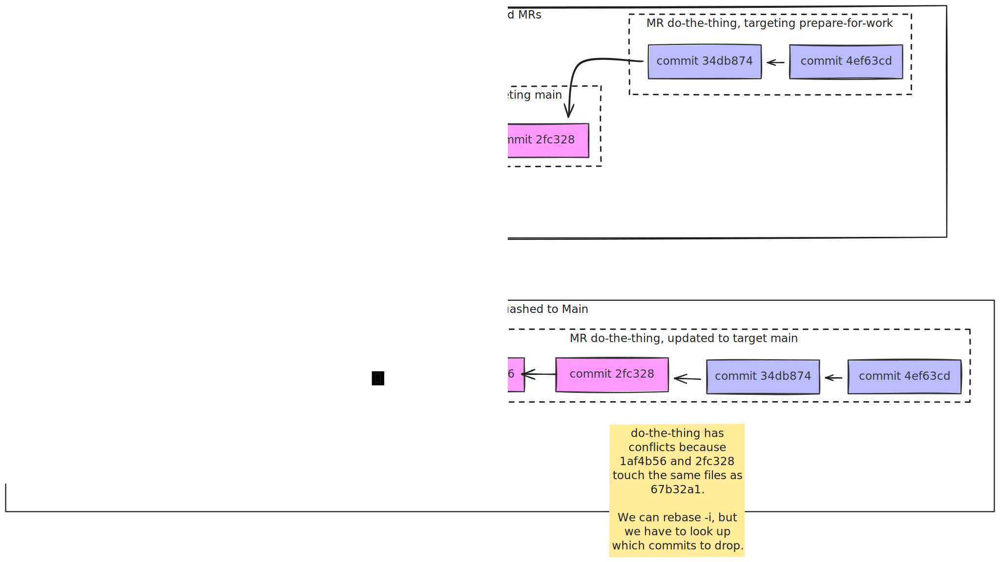

I'll assume you're already convinced that you want to try stacked MRs, and won't spend time selling it. Briefly, stacked MRs are a chain of branches with each one building upon the previous. If you want to learn more about the idea, you can read about what makes stacked diffs valuable from [Pragmatic Engineer](https://newsletter.pragmaticengineer.com/p/stacked-diffs) and [stacking.dev](https://www.stacking.dev/).

This post covers the tools and workflows I used to manage stacked merge requests on Gitlab.

## Setup steps

The most important tool in this workflow is [git-branchless](https://github.com/arxanas/git-branchless). You'll need to install it so it can start tracking branch movements in your git repository:

```sh
cargo install --locked git-branchless
# then, from your repository (repeat for each where you want this set up)
git branchless init
```

This installs hooks for many git operations, `post-checkout`, `post-commit`, etc. git branchless uses these hooks as opportunities to record the state of your repo.

## What does the workflow feel like?

A "stack" is a collection of related commits where each one builds on the previous ones. We'll ask for code review for the ones that are done, but keep working while we're waiting, adding more changes to the stack.

Here's what that can look like:

```sh
git checkout -b establish-characters
echo "Bilbo lives quietly in the Shire" > the-hobbit-outline.txt
git add the-hobbit-outline.txt && git commit -m "establish the main character: Bilbo Baggins"

echo "Gandalf arrives in the Shire" >> the-hobbit-outline.txt
git commit -am "Gandalf arrives in the Shire"
```

Let's push that up for review: create an MR requesting to merge `establish-characters → main`. I have an alias, `git create-mr`, that I'll cover more later.

While we're waiting for review, we can keep working:

```sh
git checkout -b dwarves-plan
echo "A group of dwarves arrives and eats Bilbos food" >> the-hobbit-outline.txt
git commit -am "A group of dwarves arrives and eats Bilbos food"

echo "The dwarves explain their quest" >> the-hobbit-outline.txt
git commit -am "The dwarves explain their quest"
```

Let's pause here to examine one of my favorite parts of git-branchless: the smartlog. `git sl`, short for `git smartlog`, looks like this now:

```sh
$ git sl
◇ 73af3ef 23m (main) initial commit
┃
◯ 9407e5c 1m establish the main character: Bilbo Baggins
┃
◯ 3cb382d 1m (establish-characters) Gandalf arrives in the Shire
┃
◯ ac95578 19s A group of dwarves arrives and eats Bilbos food.
┃
● eff27aa 1s (ᐅ dwarves-plan) The dwarves explain their quest
```

Let's put up another MR, this time for `dwarves-plan → establish-characters`. My magic alias, `git create-mr` is smart enough to use `establish-characters` as the target branch (more details on that later). Let's keep working.

```sh
git checkout -b adventure
echo "- The company leaves the Shire" >> the-hobbit-outline.txt
git commit -am "leave the shire at dawn"

echo "- Trolls are encountered and avoided" >> the-hobbit-outline.txt
git commit -am "troll encounter"

echo "- A ring is found in the dark" >> the-hobbit-outline.txt
git commit -am "find a strange ring in the dark"
```

And again `git create-mr` opens the merge request for us `adventure -> dwarves-plan`.

At this point, your editor gets back to you with a suggestion.

> Before we introduce Gandalf, can we establish what Bilbo’s normal life looks like? Right now his character appears only once things start happening. I’d like to see his comfort and reluctance set up first so Gandalf’s arrival actually disrupts something.

That's all the way back on our first MR! Without `git branchless`, here are the manual steps we'd have to take:

1. checkout the `establish-characters` branch, add the commit, and push the branch up to the remote.
2. check out `dwarves-plan`, rebase onto the updated `establish-characters` branch. Push it up to the remote.
3. check out the `adventure` branch, rebase onto the updated `dwarves-plan` branch. Push it up to the remote.

That's not _so_ bad, and it's what I used to do before learning this tool. But we can do better with `git branchless`.

Instead, we'll

1. check out the commit we want to change, `9407e5c establish the main character: Bilbo Baggins`.
2. Edit the text, then commit with `git commit --amend`.

Here's what that looks like:

```sh
$ git checkout 9407e5c
$ sed -i '' 's/Bilbo lives quietly in the Shire/Bilbo lives quietly in the Shire, happy with his peaceful life./' the-hobbit-outline.txt
$ git commit --amend
branchless: processing 1 update: ref HEAD
branchless: processed commit: aaeb1fa establish the main character: Bilbo Baggins
branchless: processing 1 rewritten commit
branchless: This operation abandoned 1 commit!
branchless: Consider running one of the following:
branchless:   - git restack: re-apply the abandoned commits/branches
branchless:     (this is most likely what you want to do)
branchless:   - git smartlog: assess the situation
branchless:   - git hide [<commit>...]: hide the commits from the smartlog
branchless:   - git undo: undo the operation
hint: disable this hint by running: git config --global branchless.hint.restackWarnAbandoned false
[detached HEAD aaeb1fa] establish the main character: Bilbo Baggins
 Date: Fri Feb 13 15:33:07 2026 -0800
 1 file changed, 1 insertion(+)
 create mode 100644 the-hobbit-outline.txt
```

As we run `git commit --amend`, we get a warning from `git branchless`: "This operation abandoned 1 commit!". Following their instructions, we run `git smartlog` to see what this looks like:

```sh
$ git sl
◇ 73af3ef 59m (main) initial commit
┣━┓
┃ ✕ 9407e5c 37m (rewritten as aaeb1fa3) establish the main character: Bilbo Baggins
┃ ┃
┃ ◯ 3cb382d 37m (establish-characters) Gandalf arrives in the Shire
┃ ┃
┃ ◯ ac95578 36m A group of dwarves arrives and eats Bilbos food.
┃ ┃
┃ ◯ eff27aa 36m (dwarves-plan) The dwarves explain their quest
┃ ┃
┃ ◯ 3cf52b1 21m leave the shire at dawn
┃ ┃
┃ ◯ 1923b20 21m troll encounter
┃ ┃
┃ ◯ 2ff5308 21m (adventure) find a strange ring in the dark
┃
● aaeb1fa 10s establish the main character: Bilbo Baggins
hint: there is 1 abandoned commit in your commit graph
hint: to fix this, run: git restack
hint: disable this hint by running: git config --global branchless.hint.smartlogFixAbandoned false
```

The smartlog view denotes the abandoned commit `✕ 9407e5c`, adding that it was rewritten as aaeb1fa3, and reiterates the advice to run `git restack` to fix the commit graph. Let's do that.

```sh
❯ git restack
Attempting rebase in-memory...
[1/6] Committed as: 9b56677 Gandalf arrives in the Shire
[2/6] Committed as: d23c16f A group of dwarves arrives and eats Bilbos food.
[3/6] Committed as: e0039a0 The dwarves explain their quest
[4/6] Committed as: d7b8de9 leave the shire at dawn
[5/6] Committed as: 68966c2 troll encounter
[6/6] Committed as: d4cd894 find a strange ring in the dark
branchless: processing 3 updates: branch adventure, branch dwarves-plan, branch establish-characters
branchless: processing 6 rewritten commits
In-memory rebase succeeded.
Finished restacking commits.
No abandoned branches to restack.
◇ 73af3ef 1h (main) initial commit
┃
● aaeb1fa 3m establish the main character: Bilbo Baggins
┃
◯ 9b56677 0s (establish-characters) Gandalf arrives in the Shire
┃
◯ d23c16f 0s A group of dwarves arrives and eats Bilbos food.
┃
◯ e0039a0 0s (dwarves-plan) The dwarves explain their quest
┃
◯ d7b8de9 0s leave the shire at dawn
┃
◯ 68966c2 0s troll encounter
┃
◯ d4cd894 0s (adventure) find a strange ring in the dark
```

Now we've rewritten all the commits and repointed the branches to the new ones. We still need to update the remote branches. Normally, this would mean checking out each branch and running `git push --force-with-lease`, but git branchless has `git submit` to push all your stack's branches at once.

Now that you've gotten a sense for what the workflow feels like, here are the individual pieces to make it all work.

## Pieces of the puzzle

### Get the name of the parent branch

To begin, we need a command that can tell us the correct branch. One of the subcommands git branchless provides is [git query](https://github.com/arxanas/git-branchless/wiki/Command:-git-query). This tool lets you find commits that match the conditions you need. In our case, we run

```sh
git query --branches '(ancestors(HEAD) & parents(stack())) - HEAD' | tail -1
```

That finds all commits that are ancestors of the current HEAD and _also_ immediate parents of some commit on this stack. The `--branches` flag exchanges the commits for a list of branches, then we take the latest one with `tail -1`. I have this aliased as `git merge-target`.

```toml
# ~/.gitconfig
[alias]
    merge-target = "!f() { git query --branches '(ancestors(HEAD) & parents(stack())) - HEAD' | tail -n1; }; f"
```

### Create a merge request

It's sometimes helpful to create an MR from the command line. Gitlab supports this using "push_options".

```sh
git push \
  --set-upstream origin HEAD \
  --push-option=merge_request.create \
  --push-option=merge_request.target="$(git merge-target)" \
  --push-option=merge_request.title="(title for the mr)" \
  --push-option=merge_request.description="(optional description)"
```

I have this aliased as well, `git create-mr`. It uses the most recent commit title as the MR title.

```toml
# ~/.gitconfig
[alias]
    create-mr = "!f() { git push -o merge_request.create -o merge_request.target=\"$(git merge-target)\" -o merge_request.title=\"$(git show -s --format=%s HEAD)\"; }; f"
```

### Move a commit and its descendants

We saw `git restack` earlier, which is a special case of this. `git move` is the general case. I use it a few times a day. Does what it says--moves a commit and all descendants to a new location:

```sh
git move --source <commit-or-branch> --dest <commit-or-branch>
```

If either `--source` or `--dest` are omitted, it's assumed to be HEAD.

One thing that trips me up: if the commits can't be moved without causing conflict, you'll be prompted to re-run the command with `--merge`. Adding a flag isn't hard, but the conflict resolution works using git's regular rebase flow, which hands control back to the user. That means the `git move` command has to terminate before the commits have landed, so there's no opportunity for `git move` to update the branch names to follow the moved commits.

That leads me to the next bit, fixing up branch names to follow moved commits.

### Fix up branch names after `git move --merge`

After a `git move --merge`, the branch names sometimes get left behind on the old commits. I had claude write a script to update the branches to point to the new locations: [git-move-branches](https://github.com/bgschiller/dotfiles/blob/master/bin/git-move-branches).

### Delete branches on merge

If you tick the box for "delete this branch after merge", the next MR will automatically be re-targeted to point at main. That is, if you have

- MR #1, `establish-characters → main`
- MR #2, `dwarves-plan → establish-characters`

When you merge MR #1, deleting the `establish-characters` branch, MR #2 will automatically be updated to `dwarves-plan → main`.

### Avoid squashing commits on merge

Squashing commits on merge isn't the end of the world, but it requires fixing up the MRs that follow.

Using the Hobbit example from above, if we squash the commits from `establish-characters` onto `main`, we'd end up with a tree that looked like this

```sh
$ git sl
◇ 73af3ef 2d initial commit
┣━┓
┃ ◯ aaeb1fa 2d establish the main character: Bilbo Baggins
┃ ┃
┃ ◯ 9b56677 2d (establish-characters) Gandalf arrives in the Shire
┃ ┃
┃ ◯ d23c16f 2d A group of dwarves arrives and eats Bilbos food.
┃ ┃
┃ ◯ e0039a0 2d (dwarves-plan) The dwarves explain their quest
┃ ┃
┃ ◯ d7b8de9 2d leave the shire at dawn
┃ ┃
┃ ◯ 68966c2 2d troll encounter
┃ ┃
┃ ◯ d4cd894 2d (adventure) find a strange ring in the dark
┃
◆ 83214fe 59s (ᐅ main) Establish characters (#1)
```

When the `dwarves-plan → establish-characters` MR, is updated to be `dwarves-plan → main`, it will still include the commits that originally belonged to `establish-characters`: `aaeb1fa` and `9b56677`. Since the new squashed commit, `83214fe`, includes all the changes from `aaeb1fa` and `9b56677`, it necessarily conflicts with those commits.

In the world where we _didn't_ squash, the commits kept their identity and the smartlog now looks like this:

```sh
$ git sl
⋮
◆ 9b56677 2d (ᐅ main) Gandalf arrives in the Shire
┃
◯ d23c16f 2d A group of dwarves arrives and eats Bilbos food.
┃
◯ e0039a0 2d (dwarves-plan) The dwarves explain their quest
┃
◯ d7b8de9 2d leave the shire at dawn
┃
◯ 68966c2 2d troll encounter
┃
◯ d4cd894 2d (adventure) find a strange ring in the dark
```



### Add MR prerequisites

When I have a stack of MRs my goal is to keep the diff for each one separate. In the situation from above, where the MRs are

- MR #1, `establish-characters → main`
- MR #2, `dwarves-plan → establish-characters`
- MR #3, `adventure → dwarves-plan`

I want to make sure that #2 or #3 aren't merged before #1. They can be reviewed, but if we merge them early it muddies the diffs for the upstream MR.

Gitlab has a "Merge Request Dependencies" feature, where you can list the MRs that must be merged before this one. I have a [script](https://github.com/bgschiller/dotfiles/blob/master/bin/create-mr) that creates one of these dependencies when I make an MR against a branch other than `main`. The key line is

```sh
glab api -X POST "projects/$PROJECT_ID/merge_requests/$MR_NUMBER/blocks?blocking_merge_request_id=$PARENT_MR_ID"
```

## Conclusion

That's a fair bit of faffing about with commands, so I could understand if you feel it's not worth the effort. I find that the mental model fits how I want to think about changes, and I like several of the other features of git-branchless, like `git undo` and `git smartlog`. Stacked MRs are a good tool to have if you're finding yourself frequently waiting on reviews.
