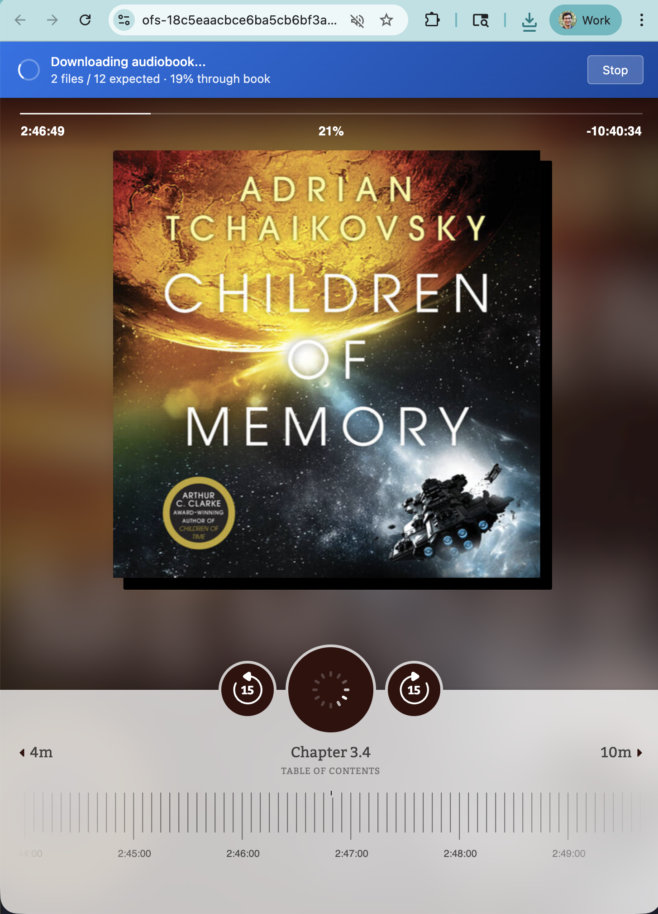
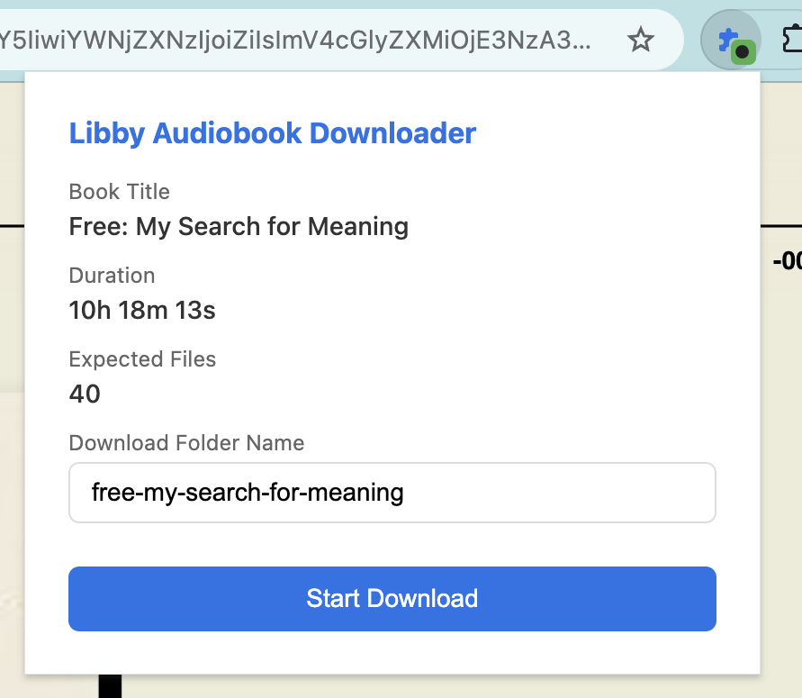

I've written in the past about the [Sync and Swim app](https://brianschiller.com/blog/2025/01/13/sync-and-swim-app/) that I put together to load music and audiobooks onto my swimming headphones. Bluetooth doesn't work underwater, so they have on-board storage and act like an mp3 player from the aughts.

I listened to music for a time, but I'm much more excited about my swim if there's a book waiting for me in the pool. The tricky thing is finding books I can download as mp3s. The library probably still has CDs of audiobooks but I don't even have a disc drive anymore.

There are _tons_ of audiobooks on Libby though, if we can find a way to download them. I put together a browser extension that steps through the book with the "forward 15 seconds" button. It monitors the media requests made by the Libby web player, downloading each new file as it is requested.

## Get it for yourself

Download the browser extension from [github.com/bgschiller/libby-web-fetch](https://github.com/bgschiller/libby-web-fetch). You should be able to install it to your browser by

1. Download the files from the [repository](https://github.com/bgschiller/libby-web-fetch)
2. Open Chrome and navigate to `chrome://extensions/`
3. Enable **Developer mode** (toggle in the top right corner)
4. Click **Load unpacked**
5. Select the `libby-web-fetch` folder

Then, when you're on the web player page for an audiobook, click the extension's icon in the extension menu (behind the little puzzle piece)

## Rewriting from Playwright

I have been using an older version of this tool for a couple of years. It used playwright instead of acting as a chrome extension but that had some drawbacks.

Node is difficult to distribute. Taking a dependency on node means it's hard to get running on someone's computer unless they're pretty familiar with the command line.

The way it was set up, playwright launched its own browser with its own set of cookies. That meant I either had to log in interactively as part of the script, or the playwright code needed to handle logging in. Either is a small nuisance. With this rewrite, I managed to avoid the issues related to logging in by piggybacking on the user's own logged-in session.

## Technical details

I decided to use jsdoc annotations to get TypeScript checking without a compile step. I didn't want to have a CI publish step or commit the files in my dist directory. Instead, the files I edit are the exact ones that can be run in a user's browser.

Chrome extensions have access to a `webRequest.onBeforeRequest` API that can intercept and potentially change outgoing network requests. The extension registers listeners for the CDN domains where audio files are stored. That way, we get a callback each time a request is sent to one of those URLs.

When the libby web player is running normally, it makes several requests with the HTTP `Range:` header, asking for small pieces of each audio file. That way, it can load quickly and avoid wasting bandwidth on parts of the track that are potentially hours away. When we're requesting, we drop the `Range:` header and make one request for the whole file.
