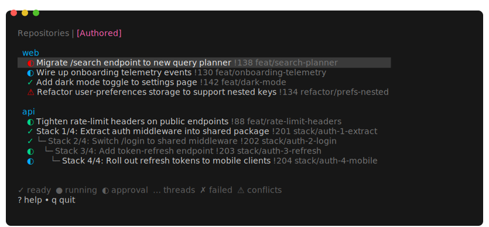
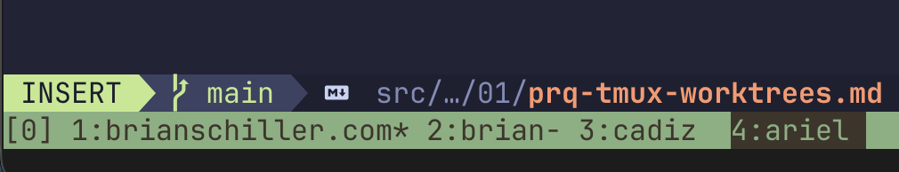

In the last year, there's been an explosion of tools to help you create worktrees. Coding agents have everyone context-switching more often, and worktrees let you run multiple coding agents simultaneously without their stepping on one another's toes. I tried a couple of them, but they didn't fit the way I wanted to work very well. Instead, I built (vibe-coded) something custom that I call `prq`.



There are two differences from other similar tools I've seen:

1. Worktrees are pooled for re-use rather than destroyed. This makes it quicker to spin one up as, eg, `pnpm install` or `cargo build` will finish more quickly with a warm cache.
2. The tool shows a list of my open pull requests and their status. This is what originally gave the tool its name, a PR Queue.

## What it feels like to use prq

Usually, prq is already running in a tmux session when I sit down at my computer. It refreshes data every 5 minutes, so it's up to date when start work in the morning. I look through to see if there are any approved PRs with green CI pipelines and merge them.

Next I might address branches with conflicts. I arrow down to them and press "t" to open a tmux window to a worktree for that branch. I rebase onto the main branch and fix conflicts (either manually, or set claude to do it). I might have several of these open, waiting on claude or `pnpm install` to finish. As they complete, their status bar entry will change color to indicate that they're ready for the next instruction. Once the conflicting branches are updated I push them up so they can start going through CI.

After fixing conflicts, I might review my coworkers' pull requests. If I want to check something in my editor, or run the code, I can use prq to get to the right spot. With the link on my clipboard, I can run `:open <url to pull request>` and prq will figure out the corresponding branch, check it out to a worktree, and open a tmux window to that directory. This also works as a CLI command: `prq open <url to pull request>`.

Next, I might review comments on my open PRs. One has only minor tweaks so I run "t" again, then set claude to work pulling down the PR feedback and addressing it (I have a skill with a bash script for downloading the unaddressed comments).

When I want to start new work, I can use the `[Repositories]` pane of prq. This lists all the repos I have set up. I can search them and (again) press "t" to open a worktree to the main branch.

prq is the primary way I keep track of my in-progress work. For better or worse, I usually have a lot of PRs in flight, and this makes sure none of them slip through the cracks.

## The worktree pool

Each repository has a naming theme for its worktrees. Some of the themes are european-cities (athens, berlin, cadiz, ...), us-cities (atlanta, boston, charlotte, ...), trees (acacia, alder, aspen, ...). The idea here is to have names we can easily distinguish, but not tied to the purpose of the work being done today (since we'll use them again tomorrow for something else). Every worktree shares the same .env and Claude settings automatically.

When the user presses "t" to navigate to a branch, the tool

1. Enumerates the open tmux panes looking at their current working directories: `tmux list-panes -a -F "#{pane_current_path}"`. Any worktrees listed here are considered "in use" and can't be repurposed.
2. Lists the existing worktrees for that repository: `git worktree list --porcelain`.
3. If it can find a worktree that's not in use, it uses that one. Otherwise, it creates a new worktree according to the naming theme.

There's another trick about how the worktrees are set up. Most repositories end up with some untracked local config files. Think `.env`, `.envrc`, or `.claude/settings.local.json`. Each repo has a directory structure like

```
acme-web
├── colorado (a worktree)
├── danube (a worktree)
├── euphrates (a worktree)
└── shared (untracked configuration files)
    ├── .envrc
    └── .claude
        └── settings.local.json
```

When `prq` makes a worktree, it also creates symlinks to make it appear as though the files in `{project-root}/shared` are in the root of the worktree. That way, when you change an environment variable or a claude permission in one subtree, it changes for all of them.

Pooling worktrees like this means starting a new task is extremely quick, and I also don't worry about cleaning up the worktrees when I'm done. I just continue to have as many as the high-water mark of my concurrent use in that repo.

## Stacked PRs

I've been using stacked PRs more frequently to avoid waiting on code review (see [Stacked MRs with git branchless](https://brianschiller.com/blog/2026/02/15/git-branchless-stacked/)). I wanted to make sure `prq` could handle stacked PRs.

When it queries github and gitlab, `prq` records the target branch of each PR. This lets it build a little ASCII-art tree illustrating the stack of PRs. If your branches are stacked on top of someone else's open PR, or interleaved with their work, it will fill out the stack to avoid missing anything (the greyed out rows in the screenshot at the top of the page).

## tmux Status Bar

I'm often opening these windows, setting an agent to work, and then tabbing away to do something else. So it's useful to get a notification when one of them is ready for my attention. I have claude set up to run a `~/bin/claude_attention` script on the "Stop" hook. It includes a line setting a custom variable, `@claude_attention`, to 1.

```sh
tmux set-window-option -t "${tmuxPane}" @claude_attention 1
```

Next, I have tmux configured to change the window-status-format according that same variable. When it's set, the window's name is shown in inverted colors. In the screenshot below, the window labelled `ariel` has a claude session that wants my attention.



When I focus into that pane, the custom variable is zeroed out.

```sh
set -g window-status-format "#{?@claude_attention,#[reverse],}#I:#W#{?window_flags,#{window_flags}, }#[default]"
set-hook -g pane-focus-in 'set-window-option @claude_attention 0'
```

## Conclusion

I've been using `prq` every day since about January. Sometimes it feels like a cheat code, like I ought to spread the word and evangelize how nice it is to work this way. If it sounds useful to you, I hope you borrow and remix the ideas. (I'll work on open sourcing the code, but I created it at work and need to get permission).
