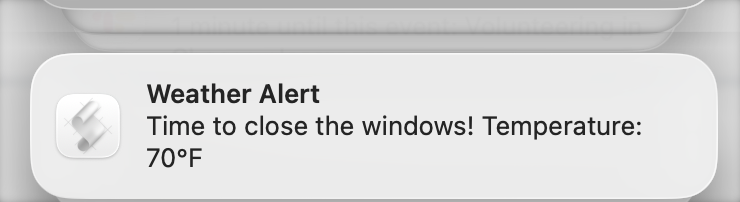

In the Spring and Summer, we open up the windows at night and turn on fans to try and clear out the warm air, then close everything up again when the outside air heats up. But I often forget to close the windows, noticing only at lunchtime when I've already overshot.

Today, I was surprised to see a notification reminding me to close the windows.

I remembered: last year, I vibe-coded a script to help. Every five minutes, if

- the month is between May and September, and
- we haven't yet sent a notification today, and
- The [open-meteo.com](https://open-meteo.com/) API reports a temperature above 70°F,

then it shows the notification.

I used an app called [Lingon X](https://www.peterborgapps.com/lingon/) to set up the "run every 5 minutes" bit using launchd. Today, I would probably have Claude Code do it.

The script itself is available at [bgschiller/dotfiles#close_windows_check.sh](https://github.com/bgschiller/dotfiles/blob/c8c7439649fbce312a6ee2bb5840f31edffb9ab9/close_windows_check.sh).
