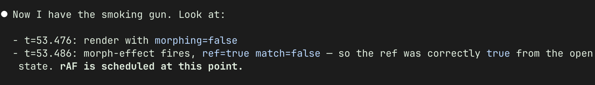

If you've worked with Claude Code or another AI agent to debug something, it's probably pointed out a "smoking gun" or two. In case you haven't, here's an example screenshot I found.

You've probably also found that it's frequently _wrong_ about the smoking gun&mdash;the "smoking gun" it identifies ends up not being a problem. Here are a couple more screenshots:

My guess for why this happens is that the LLM has ingested _tons_ of narratives: both blog posts about solving bugs and Agatha Christie novels. Built into the weights of the model, it has a belief about where the reveal ought to occur in a mystery. So when it's time for the reveal, it latches onto the next plausible clue and declares it "the smoking gun!".

Putting this together helps my intuition about how LLMs work. They're extremely useful for debugging, but definitely get "impatient" when the debugging drags on.
